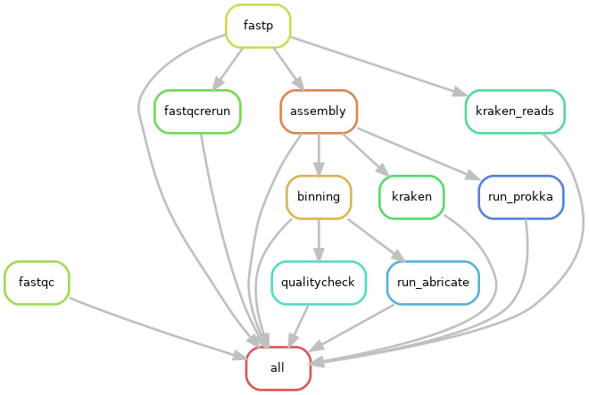

# Snakemake workflow: amr-detection-pipeline


Snakemake workflow for detecting AMR genes from Illumina paired-end short reads. This pipeline comprises of several steps including (a) Quality control and checks (b) Filtering for low-quality reads (c) Taxonomic identification using Kraken from short reads (d) Metagenomic assembly from short reads (e) Binning the assemblies (f) Quality checks of the assemblies (g) Taxonomic identification of assemblies using Kraken (h) Antibiotic resistance genes (ARGs) identification from assemblies 

## Installing the pipeline

This pipeline requires conda to install package. Conda can be installed in multiple ways such as:

1. Using [Mambaforge](https://mamba.readthedocs.io/en/latest/installation/mamba-installation.html)

```bash
curl -L <https://github.com/conda-forge/miniforge/releases/latest/download/Mambaforge-Linux-x86_64.sh> -o Mambaforge-Linux-x86_64.sh
bash Mambaforge-Linux-x86_64.sh
```

2. Using [Anaconda](https://docs.anaconda.com/free/anaconda/install/linux/) (Check terms and conditions before use).

## Commands to run the pipeline

The basic steps in the workflow:

1. Download the repository to your system.
2. Create the mamba environment with all necessary packages [Modify appropriately if you use conda]

```bash
mamba env create --name amr-detection --file config/amr_detection_pipeline.yaml
mamba activate amr-detection

```

3. Navigate to `script` folder and make a json file with all the sample details by running

```python
python make_json_new.py --fastq_dir <dir_name>
```

Replace `<dir_name>` with the name of folder containing all the sequences.


❗**IMPORTANT** 

Sequences should be in the format `<sample_name>_1.fastq.gz`, `<sample_name>_2.fastq.gz`. 

The directory where the sequences are should be in the following structure:

```data/
├── A_1.fastq.gz
├── A_2.fastq.gz
├── B_1.fastq.gz
└── B_2.fastq.gz
```

Run snakemake file to process all the files

```bash
snakemake --cores n
```

where `n` is the number of cores that you want snakemake to run on.


📔**Notes**

1. This pipeline comes with in-built Kraken database (Standard-8). If you want to change the database, you can download it from [Kraken website](https://benlangmead.github.io/aws-indexes/k2).  
2. Some steps (metagenomic assembly and quality checking of bins) use a lot of memory and are time consuming. Please be aware of this!


## Execution framework



## Details on the steps in the pipeline

The major steps in the pipeline can be classified into three major categories

### Quality control and filtering

1. [FastQC](https://github.com/s-andrews/FastQC) - It is a program designed to identify potential sequencing errors and will produce the sequencing statistics.
2. [Fastp](https://academic.oup.com/bioinformatics/article/34/17/i884/5093234) - It is a tool used for preprocessing fastq sequences and perfoms several functions including quality control, adapter trimming, quality filtering, per-read quality pruning.

### Taxonomic classification

1. [Kraken](https://genomebiology.biomedcentral.com/articles/10.1186/gb-2014-15-3-r46) - Filtered fastq reads are then used for taxonomic classification using Kraken. This is k-mer based classification tool that assigns taxonomy to the sequencing reads and assemblies.

### Metagenomic assembly, annotation and ARG identification

1. [Metaspades](https://pmc.ncbi.nlm.nih.gov/articles/PMC5411777/) - Tool for assembling metagenomic sequences to recover genomes from short read sequencing data.
2. [Metabat2](https://pmc.ncbi.nlm.nih.gov/articles/PMC6662567/) - Tool for generating bins from metagenomic assemblies.
3.  [CheckM](https://pmc.ncbi.nlm.nih.gov/articles/PMC4484387/) - Tool for checking the quality of genomes based on a set of marker genes. This tool gives an idea of genome completeness and contamination.
4. [Prokka](https://academic.oup.com/bioinformatics/article/30/14/2068/2390517) - Used for annotating prokaryotic genomes to get functional insights.
5. [Abricate](https://github.com/tseemann/abricate) - Tool for high-throughput identification of antibiotic resistance genes from contigs.
